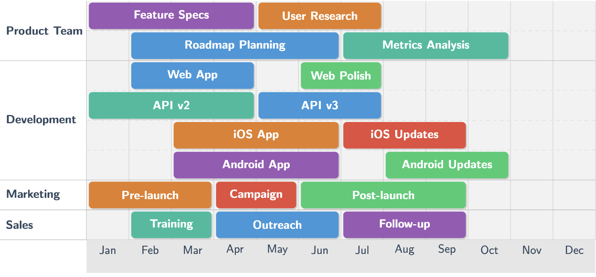
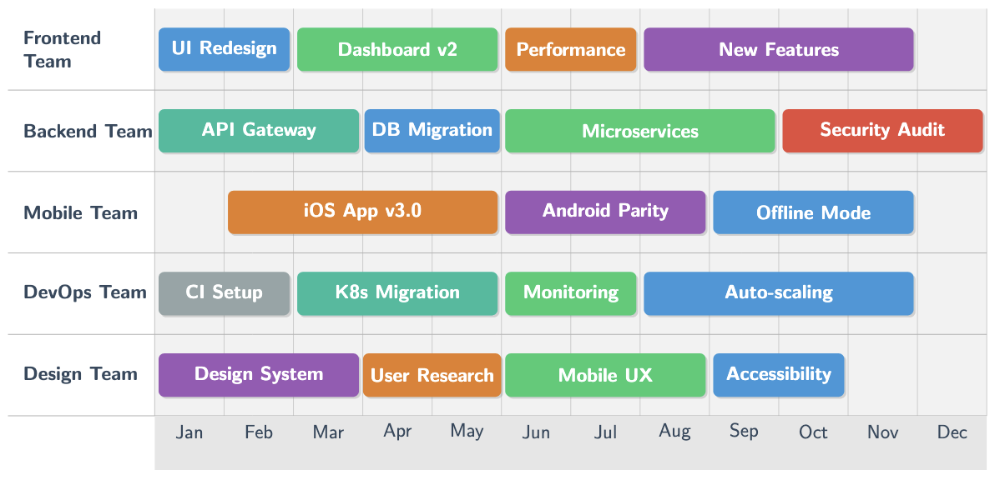
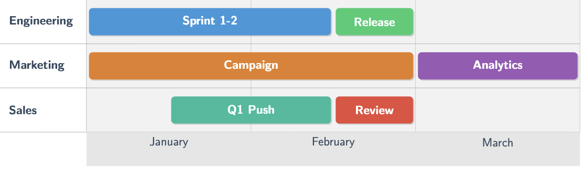
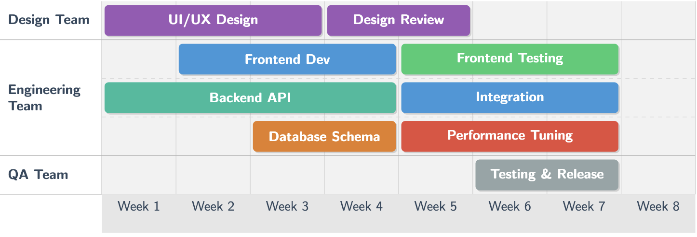
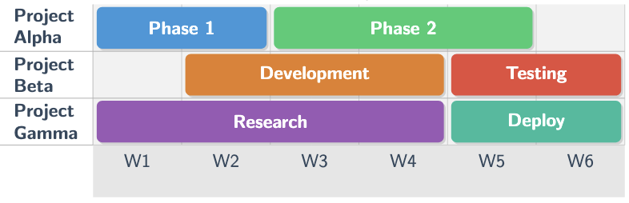
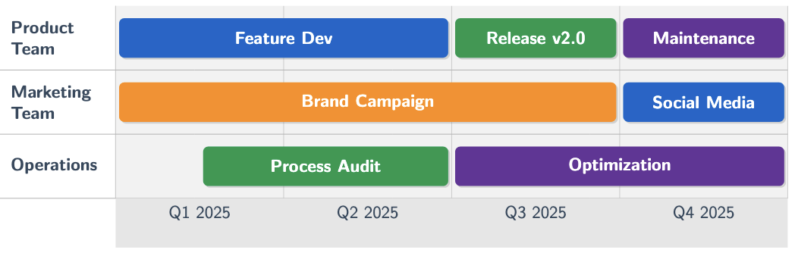
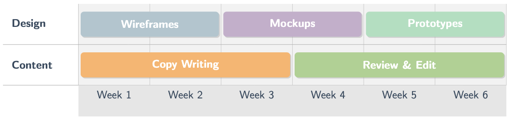
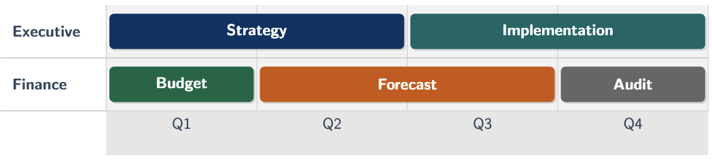

# tikz-roadmap

A LaTeX package for creating professional team roadmaps and project timelines using TikZ.



## Features

- **Flexible Layout**: Adjustable width, row heights, and timeline customization
- **Multiple Teams/Projects**: Support for unlimited team or project rows
- **Resizable Task Boxes**: Tasks can span any number of time periods with adjustable duration
- **Color-Coded Tasks**: Built-in color scheme with 7 predefined colors
- **Professional Appearance**: Modern design with rounded corners and drop shadows
- **Easy to Use**: Simple, intuitive syntax for defining roadmaps

## Installation

### Local Installation

1. Place `tikz-roadmap.sty` in your LaTeX project directory, or
2. Install it in your local texmf tree:
   ```bash
   # Find your local texmf directory
   kpsewhich -var-value=TEXMFHOME

   # Copy the package file
   cp tikz-roadmap.sty ~/texmf/tex/latex/tikz-roadmap/

   # Update the package database
   texhash ~/texmf
   ```

### Requirements

- LaTeX with TikZ (included in most modern TeX distributions)
- Required packages (automatically loaded):
  - `tikz`
  - `xcolor`
  - `calc`
  - `pgfkeys`
  - `etoolbox`

## Usage

### Basic Example

```latex
\documentclass{article}
\usepackage{tikz-roadmap}

\begin{document}

\begin{roadmap}
  % Define team/project rows
  \roadmaprow{Frontend Team}
  \roadmaprow{Backend Team}
  \roadmaprow{DevOps Team}

  % Define timeline labels
  \roadmaptimeline{"Q1","Q2","Q3","Q4"}

  % Add tasks: \roadmaptask[color]{row}{start}{duration}{title}
  \roadmaptask[blue]{1}{1}{2}{UI Redesign}
  \roadmaptask[green]{2}{2}{3}{API Development}
  \roadmaptask[orange]{3}{3}{2}{CI/CD Setup}
\end{roadmap}

\end{document}
```

### Configuration Options

The `roadmap` environment accepts optional parameters:

```latex
\begin{roadmap}[
  width=16cm,           % Total width of the roadmap (default: 15cm)
  row height=1.5cm,     % Height of each team/project row (default: 1.2cm)
  timeline height=1cm,  % Height of the timeline strip (default: 1cm)
  columns=12            % Number of time periods (default: 12)
]
  % ... roadmap content
\end{roadmap}
```

### Commands

#### `\roadmaprow{label}`

Defines a team or project row.

**Parameters:**
- `label`: The text label for the row (e.g., "Engineering Team", "Project Alpha")

**Example:**
```latex
\roadmaprow{Mobile Team}
\roadmaprow{Design Team}
```

#### `\roadmaptimeline{labels}`

Sets the timeline labels displayed at the bottom.

**Parameters:**
- `labels`: Comma-separated list of labels in quotes

**Example:**
```latex
% Monthly timeline
\roadmaptimeline{"Jan","Feb","Mar","Apr","May","Jun","Jul","Aug","Sep","Oct","Nov","Dec"}

% Quarterly timeline
\roadmaptimeline{"Q1 2025","Q2 2025","Q3 2025","Q4 2025"}

% Weekly timeline
\roadmaptimeline{"W1","W2","W3","W4","W5","W6"}
```

#### `\roadmaptask[color]{row}{start}{duration}{title}`

Adds a task box to the roadmap.

**Parameters:**
- `color` (optional): Color name (blue, green, orange, purple, red, teal, gray). Default: blue
- `row`: Row number (1-indexed)
- `start`: Starting column position (1-indexed, can be fractional like 1.5)
- `duration`: Number of columns the task spans (can be fractional like 2.5)
- `title`: Text displayed in the task box

**Example:**
```latex
% Task starting at column 1, spanning 2 columns
\roadmaptask[blue]{1}{1}{2}{Phase 1}

% Task starting at column 3.5, spanning 1.5 columns
\roadmaptask[green]{2}{3.5}{1.5}{Sprint 3}
```

### Multi-Lane Roadmaps

For teams working on multiple concurrent tasks, you can create multi-lane rows where each team can have N parallel tracks.

#### `\multiroadmaprow{lanes}{label}`

Creates a row with multiple lanes for concurrent tasks.

**Parameters:**
- `lanes`: Number of concurrent lanes (e.g., 2, 3, 4)
- `label`: The text label for the row

**Example:**
```latex
\multiroadmaprow{3}{Engineering Team}  % Team with 3 concurrent work streams
```

#### `\multiroadmaptask[color]{row}{lane}{start}{duration}{title}`

Adds a task to a specific lane within a multi-lane row.

**Parameters:**
- `color` (optional): Color name (blue, green, orange, purple, red, teal, gray). Default: blue
- `row`: Row number (1-indexed)
- `lane`: Lane number within the row (0-indexed, from 0 to N-1)
- `start`: Starting column position (1-indexed, can be fractional)
- `duration`: Number of columns the task spans (can be fractional)
- `title`: Text displayed in the task box

**Example:**
```latex
\begin{roadmap}[width=16cm, row height=1cm, columns=6]
  \multiroadmaprow{3}{Development Team}

  \roadmaptimeline{"M1","M2","M3","M4","M5","M6"}

  % Lane 0 (top lane)
  \multiroadmaptask[blue]{1}{0}{1}{2}{Feature A}
  \multiroadmaptask[green]{1}{0}{3}{2}{Feature B}

  % Lane 1 (middle lane)
  \multiroadmaptask[orange]{1}{1}{2}{3}{Bug Fixes}

  % Lane 2 (bottom lane)
  \multiroadmaptask[purple]{1}{2}{1}{4}{Refactoring}
\end{roadmap}
```

**Notes:**
- Multi-lane rows automatically expand to accommodate all lanes (each lane uses `row height`)
- Lane separators are drawn as dashed lines
- You can mix regular `\roadmaprow` and `\multiroadmaprow` in the same roadmap
- Regular tasks on multi-lane rows use `\roadmaptask` and default to lane 0

### Available Colors

- `blue` (default):  roadmapblue
- `green`:  roadmapgreen
- `orange`:  roadmaporange
- `purple`:  roadmappurple
- `red`:  roadmapred
- `teal`:  roadmapteal
- `gray`:  roadmapgray

## Complete Examples

### Annual Roadmap (12 Months)

```latex
\begin{roadmap}[width=16cm, row height=1.5cm, columns=12]
  \roadmaprow{Frontend Team}
  \roadmaprow{Backend Team}
  \roadmaprow{Mobile Team}

  \roadmaptimeline{"Jan","Feb","Mar","Apr","May","Jun","Jul","Aug","Sep","Oct","Nov","Dec"}

  \roadmaptask[blue]{1}{1}{2}{UI Redesign}
  \roadmaptask[green]{1}{3}{3}{Dashboard v2}
  \roadmaptask[purple]{1}{8}{4}{New Features}

  \roadmaptask[teal]{2}{1}{3}{API Gateway}
  \roadmaptask[orange]{2}{4}{4}{Microservices}

  \roadmaptask[red]{3}{2}{4}{iOS App v3.0}
  \roadmaptask[blue]{3}{6}{3}{Android Update}
\end{roadmap}
```



### Quarterly Roadmap (3 Months)

```latex
\begin{roadmap}[width=14cm, row height=1.3cm, columns=3]
  \roadmaprow{Engineering}
  \roadmaprow{Marketing}
  \roadmaprow{Sales}

  \roadmaptimeline{"January","February","March"}

  \roadmaptask[blue]{1}{1}{1.5}{Sprint 1-2}
  \roadmaptask[green]{1}{2.5}{0.5}{Release v1.0}

  \roadmaptask[orange]{2}{1}{2}{Launch Campaign}
  \roadmaptask[purple]{2}{3}{1}{Analytics Review}

  \roadmaptask[teal]{3}{1.5}{1}{Q1 Sales Push}
  \roadmaptask[red]{3}{2.5}{0.5}{Performance Review}
\end{roadmap}
```



### Multi-Lane Roadmap (Concurrent Work Streams)

```latex
\begin{roadmap}[width=16cm, row height=1cm, columns=8]
  \roadmaprow{Design Team}
  \multiroadmaprow{3}{Engineering Team}
  \roadmaprow{QA Team}

  \roadmaptimeline{"W1","W2","W3","W4","W5","W6","W7","W8"}

  % Single-lane design team
  \roadmaptask[purple]{1}{1}{3}{UI/UX Design}
  \roadmaptask[purple]{1}{4}{2}{Design Review}

  % Engineering team with 3 concurrent streams
  \multiroadmaptask[blue]{2}{0}{2}{3}{Frontend Development}
  \multiroadmaptask[green]{2}{0}{5}{3}{Frontend Testing}

  \multiroadmaptask[teal]{2}{1}{1}{4}{Backend API}
  \multiroadmaptask[blue]{2}{1}{5}{3}{Integration}

  \multiroadmaptask[orange]{2}{2}{3}{2}{Database}
  \multiroadmaptask[red]{2}{2}{5}{3}{Performance Optimization}

  % Single-lane QA team
  \roadmaptask[gray]{3}{6}{2}{Testing \& Release}
\end{roadmap}
```



### Sprint Planning (Weeks)

```latex
\begin{roadmap}[width=12cm, row height=0.9cm, columns=6]
  \roadmaprow{Project Alpha}
  \roadmaprow{Project Beta}
  \roadmaprow{Project Gamma}

  \roadmaptimeline{"Week 1","Week 2","Week 3","Week 4","Week 5","Week 6"}

  \roadmaptask[blue]{1}{1}{2}{Planning \& Design}
  \roadmaptask[green]{1}{3}{3}{Development}
  \roadmaptask[orange]{1}{6}{1}{Testing}

  \roadmaptask[purple]{2}{2}{3}{Implementation}
  \roadmaptask[red]{2}{5}{2}{QA \& Deploy}

  \roadmaptask[teal]{3}{1}{4}{Research Phase}
  \roadmaptask[blue]{3}{5}{2}{Prototype}
\end{roadmap}
```



## Tips and Best Practices

1. **Fractional Positioning**: Use fractional values for precise task placement
   ```latex
   \roadmaptask[blue]{1}{1.5}{2.5}{Overlapping Task}
   ```

2. **Compact View**: For smaller roadmaps, reduce row height
   ```latex
   \begin{roadmap}[row height=0.8cm]
   ```

3. **Wide Roadmaps**: Increase width for more detailed timelines
   ```latex
   \begin{roadmap}[width=18cm, columns=24]
   ```

4. **Color Consistency**: Use consistent colors for task types
   - Blue for development tasks
   - Green for completed milestones
   - Orange for design/planning
   - Red for urgent/critical items

5. **Timeline Granularity**: Match columns to your needs
   - 12 columns for monthly views
   - 4 columns for quarterly views
   - 52 columns for weekly views

## Customization

### Redefining Built-in Colors

The package defines several colors that can be customized by redefining them in your preamble:

```latex
\documentclass{article}
\usepackage{tikz-roadmap}

% Redefine built-in colors with your preferred tints
\definecolor{roadmapblue}{RGB}{52,152,219}    % Default task color
\definecolor{roadmapgreen}{RGB}{46,204,113}   % Success/completion
\definecolor{roadmaporange}{RGB}{230,126,34}  % Warning/planning
\definecolor{roadmappurple}{RGB}{155,89,182}  % Feature work
\definecolor{roadmapred}{RGB}{231,76,60}      % Urgent/critical
\definecolor{roadmapteal}{RGB}{26,188,156}    % Infrastructure
\definecolor{roadmapgray}{RGB}{149,165,166}   % Low priority
\definecolor{roadmapdarkgray}{RGB}{52,73,94}  % Used for text

\begin{document}
% Your roadmaps here
\end{document}
```

### Adding Custom Colors

You can define your own custom colors and use them in tasks by modifying the package's color detection logic. The easiest approach is to redefine the built-in color names with your custom tints:

```latex
\documentclass{article}
\usepackage{tikz-roadmap}

% Override built-in colors with your brand colors
\definecolor{roadmapblue}{RGB}{0,102,204}     % Your company blue
\definecolor{roadmapgreen}{RGB}{0,153,76}     % Your company green
\definecolor{roadmaporange}{RGB}{255,140,0}   % Your preferred orange tint

\begin{document}

\begin{roadmap}[width=14cm, row height=1.5cm, columns=4]
  \roadmaprow{Product Team}
  \roadmaprow{Marketing Team}

  \roadmaptimeline{"Q1","Q2","Q3","Q4"}

  % These will use your custom color definitions
  \roadmaptask[blue]{1}{1}{2}{Development}      % Uses your blue (0,102,204)
  \roadmaptask[green]{1}{3}{1}{Launch}          % Uses your green (0,153,76)
  \roadmaptask[orange]{2}{1}{3}{Campaign}       % Uses your orange (255,140,0)
\end{roadmap}

\end{document}
```



### Color Scheme Examples

#### Pastel Theme
```latex
\definecolor{roadmapblue}{RGB}{174,198,207}
\definecolor{roadmapgreen}{RGB}{169,209,142}
\definecolor{roadmaporange}{RGB}{255,179,102}
\definecolor{roadmappurple}{RGB}{198,174,204}
```



#### Dark Theme
```latex
\definecolor{roadmapblue}{RGB}{41,128,185}
\definecolor{roadmapgreen}{RGB}{39,174,96}
\definecolor{roadmaporange}{RGB}{211,84,0}
\definecolor{roadmappurple}{RGB}{142,68,173}
```

#### Corporate/Professional Theme
```latex
\definecolor{roadmapblue}{RGB}{0,51,102}
\definecolor{roadmapgreen}{RGB}{0,102,68}
\definecolor{roadmaporange}{RGB}{204,85,0}
\definecolor{roadmapgray}{RGB}{102,102,102}
```



## Compilation

Compile your document with `pdflatex`:

```bash
pdflatex your-document.tex
```

## Example Output

See [example.tex](example.tex) for a complete working example with multiple roadmap styles.

To compile the example:

```bash
pdflatex example.tex
```

## License

MIT License

## Contributing

Feel free to submit issues and enhancement requests!
